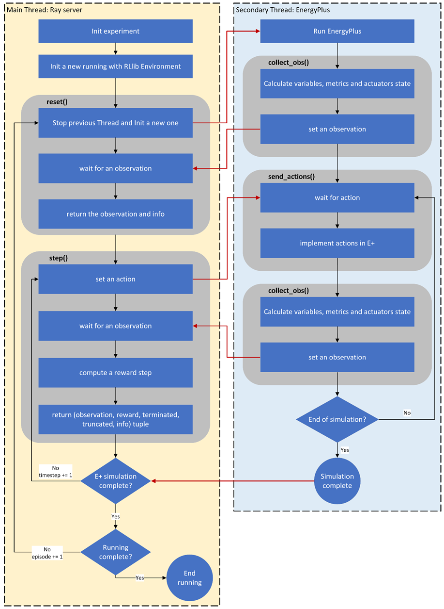

# DRL-based natural ventilation management model with RLlib and EnergyPlus

## Description

Buildings have proven to be one of the energy sinks in recent decades. Both the industrial and commercial sectors and the residential sector are consumers of a large part of the energy and responsible for greenhouse gas emissions due to these consumptions. In general, these consumptions are associated with the use of energy inside buildings. In the residential sector, in particular, most of the primary energy is consumed for heating, ventilation or air conditioning (HVAC) and for cooking food. Currently, HVAC systems are automated to achieve high performance and high comfort features. However, they have many problems still unresolved. Its automation is based on instantaneous variables and does not consider the user's activity or the use of passive air conditioning strategies in the home, such as natural ventilation, taking advantage of the sun through windows. On the other hand, the accelerated development of artificial intelligence in recent years provides novel tools to address complex problems such as the energy operation of a building. Within these tools, DRL (Deep Reinforcement Learning) adapts well to the type of problem to be solved. It is for all this that the development of a control model that manages energy use is proposed, considering the user's activity and the bioclimatic strategies that a home has, particularly for this work, natural ventilation.

## Repository organization

```
-> EP_IDF_Configuration # Folder where the building models are allocated.
    -> file_to_simulate.epJSON
-> EP_Wheather_Configuration # Folder where the weather file and the statistical of the respective wheather are allocated. You will find in the preprocess folder a notebook to calculate the statisticals pkl file from the epw.
    -> wheather_file.epw
    -> wheather_stats.pkl
-> postprocess
    -> postprocess_file.ipynb
-> preprocess
    ->clima_stads.ipynb
-> env
    -> natural_ventilation
        ->nv_rllib_env.py
        ->nv_ep_runner.py
-> evaluation
    -> init_conventional.py
    -> init_evaluation.py
-> init_training.py
```

El repositorio tiene tres archivos principales que configuran el funcionamiento del experimento.

Los archivos se pueden identificar con DQN, QMIX y EVAL. Cada uno de estos corresponde al algoritmo para el cuál está configurado o si es para la evaluación de estos.

A su vez se puede identificar **init_simulation**, **ep_gym_env** y **ep_runner**. El primero configura el algoritmo, para el cual se utiliza la librería de **RLlib**, en donde se pueden ajustar los hiperparámetros con la herramienta de Tune o bien entrenar las políticas para una configuración específica de estos. El segundo contiene la configuración estándar de un entorno de OpenAI Gym (ahora gymnasium), donde se define la función de recompensa y los métodos `step` y `reset`. Este se relaciona directamente con el tercero, el cual ejecuta la simulación en EnergyPlus del entorno simulado. Para una ejecución sincronizada de ambos hilos se utiliza un mecanimos de comunicación con la librería `Queue`, que permite la configuración de EnergyPlus como entorno de Gym.



### Controles convencionales

Se establecen los mecanísmos de control de diferentes elementos:

* Cortinas
* Ventanas
* Encendido y apagado de refrigeración y calefacción
* Temperatura del termostato dual

Estos se establecen según reglas convencionales intuitivas que son las que se utilizan actualmente en
edificios residenciales.

### Estadísticas de clima

### Herramientas adicionales

## Modo de uso

## Contribución

## Licencia


