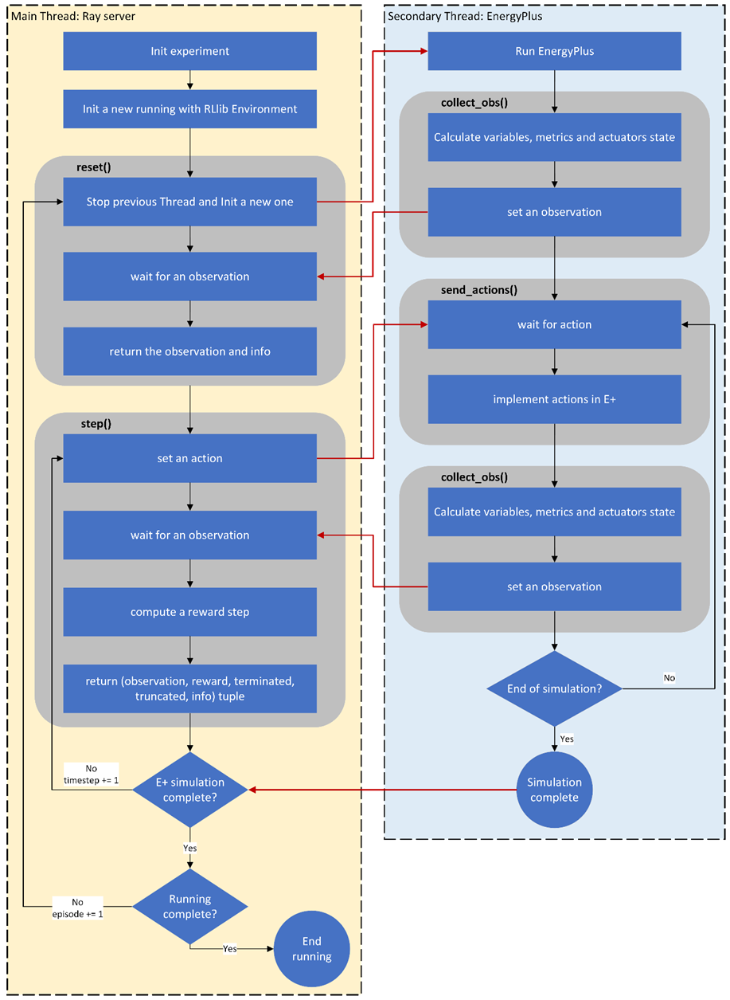

# DRL-based natural ventilation management model with RLlib and EnergyPlus

## Description

Buildings have proven to be one of the energy sinks in recent decades. Both the industrial and commercial sectors and the residential sector are consumers of a large part of the energy and responsible for greenhouse gas emissions due to these consumptions. In general, these consumptions are associated with the use of energy inside buildings. In the residential sector, in particular, most of the primary energy is consumed for heating, ventilation or air conditioning (HVAC) and for cooking food. Currently, HVAC systems are automated to achieve high performance and high comfort features. However, they have many problems still unresolved. Its automation is based on instantaneous variables and does not consider the user's activity or the use of passive air conditioning strategies in the home, such as natural ventilation, taking advantage of the sun through windows. On the other hand, the accelerated development of artificial intelligence in recent years provides novel tools to address complex problems such as the energy operation of a building. Within these tools, DRL (Deep Reinforcement Learning) adapts well to the type of problem to be solved. It is for all this that the development of a control model that manages energy use is proposed, considering the user's activity and the bioclimatic strategies that a home has, particularly for this work, natural ventilation.

## Repository organization

The repository is ordned to be easy to read and to develope.

In the main folder there are three scripts that are used to configurate the experiment to be running or execute the evaluation of the policy trained and compare with the conventional policy.

-> init_training.py
-> init_conventional.py
-> init_evaluation.py

### agents

This folder is where the agent's models are allocated. For now the only agent runeable is `conventional` used to produce conventional actions in the environment to operate the opening of windows.
```
policy_config = { # conventional control config
    'SP_temp': 22, #es el valor de temperatura de confort
    'dT_up': 2.5, #es el límite superior para el rango de confort
    'dT_dn': 2.5, #es el límite inferior para el rango de confort
}

policy = Conventional(policy_config)
# define the conventional policy

# ...
# obtain here an observation of the environment

action_1 = policy.window_opening(Ti, To, action_w1)
# obtain the action of the conventional policy
```

This module is used now only in the conventional evaluation to compare the DRL algorithm counter this RB control.

In the future is expected to implement new agents to involucrate defferent inhabitants profiles or users.

### env

In this folder there are alocated two files that together implement the environment in Ray-RLlib. Both scripts are executed in different threads to allow the simulation of EnergyPlus Python API in a reinforcement learning way (a Markov Decission Process).

In the nex image is show how the two scripts are related to coordinate the steps.



### epjson

The environment implemented need a EnergyPlus input file. This file could be defined as an IDF file or an epJSON file. We use here the epJSON file because is easier to manipulate in the EnergyPlus Python API. Here are allocated the buildings model files.

### epw

Also EnergyPlus requires a weather epw file. This experiment run a building of the GEF IPV Argentina project. The project is allocated in all the country and here are the weather files for the Province of Mendoza only.

### postprocess

After training, the evaluation is defined as a postprocess. Here the two policies (conventional or RB and DRL) are compare. Also the policy follow for the DRL policy in each device is important to analisys and the beheavior of the neural network connections too.

In this folder there are different notebook to this propose.

### tools

Different utilities are defined to use across the configurations. Here are alocated.

## How to use and how to work

To use you must to configurate the `VENT_init_training.py` and execute the experiment.

## Contribution

(work in progress)

## Licency

MIT License

Copyright (c) 2024 hermmanhender

Permission is hereby granted, free of charge, to any person obtaining a copy
of this software and associated documentation files (the "Software"), to deal
in the Software without restriction, including without limitation the rights
to use, copy, modify, merge, publish, distribute, sublicense, and/or sell
copies of the Software, and to permit persons to whom the Software is
furnished to do so, subject to the following conditions:

The above copyright notice and this permission notice shall be included in all
copies or substantial portions of the Software.

THE SOFTWARE IS PROVIDED "AS IS", WITHOUT WARRANTY OF ANY KIND, EXPRESS OR
IMPLIED, INCLUDING BUT NOT LIMITED TO THE WARRANTIES OF MERCHANTABILITY,
FITNESS FOR A PARTICULAR PURPOSE AND NONINFRINGEMENT. IN NO EVENT SHALL THE
AUTHORS OR COPYRIGHT HOLDERS BE LIABLE FOR ANY CLAIM, DAMAGES OR OTHER
LIABILITY, WHETHER IN AN ACTION OF CONTRACT, TORT OR OTHERWISE, ARISING FROM,
OUT OF OR IN CONNECTION WITH THE SOFTWARE OR THE USE OR OTHER DEALINGS IN THE
SOFTWARE.


