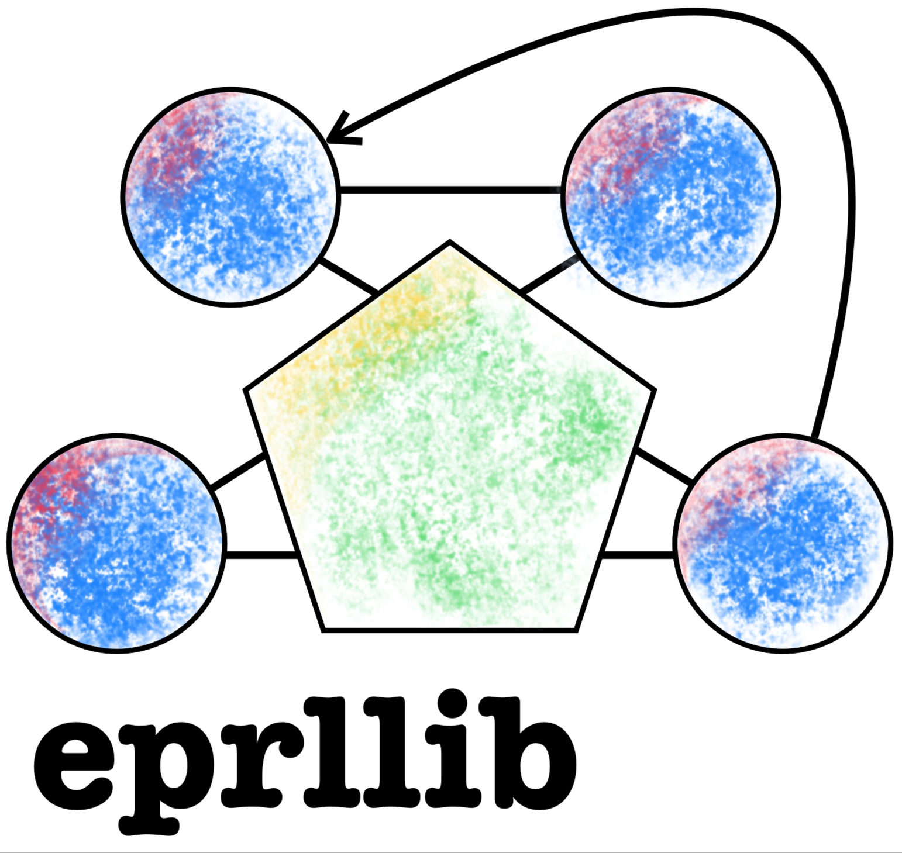

[](https://hermmanhender.github.io/eprllib/)

[](https://github.com/hermmanhender/eprllib/actions/workflows/pages/pages-build-deployment)

[](https://github.com/hermmanhender/eprllib/actions/workflows/test-python-package.yml)

# eprllib: use EnergyPlus as an environment for RLlib 

This repository provides a set of methods to establish the computational loop of EnergyPlus within a Markov Decision Process (MDP), treating it as a multi-agent environment compatible with RLlib. The main goal is to offer a simple configuration of EnergyPlus as a standard environment for experimentation with Deep Reinforcement Learning.

## Installation

To install EnergyPlusRL, simply use pip:

```
pip install eprllib
```

## Key Features

* Integration of EnergyPlus and RLlib: This package facilitates setting up a Reinforcement Learning environment using EnergyPlus as the base, allowing for experimentation with energy control policies in buildings.
* Simplified Configuration: To use this environment, you simply need to provide a configuration in the form of a dictionary that includes state variables, metrics, actuators (which will also serve as agents in the environment), and other optional features.
* Flexibility and Compatibility: EnergyPlusRL easily integrates with RLlib, a popular framework for Reinforcement Learning, enabling smooth setup and training of control policies for actionable elements in buildings.

## Usage

1. Import eprllib.
2. Configure EnvConfig to provide a EnergyPlus model based configuration, specifying the parameters required (see eprllib.Env.EnvConfig).
3. Configure RLlib algorithm to train the policy.
4. Execute the training using RLlib or Tune.

## Contribution

Contributions are welcome! If you wish to improve this project or add new features, feel free to submit a pull request.
Checkout our *Code of Conduct* and *How to Contribute* documentation.

## Licency

MIT License

Copyright (c) 2024 Germán Rodolfo Henderson

Permission is hereby granted, free of charge, to any person obtaining a copy
of this software and associated documentation files (the "Software"), to deal
in the Software without restriction, including without limitation the rights
to use, copy, modify, merge, publish, distribute, sublicense, and/or sell
copies of the Software, and to permit persons to whom the Software is
furnished to do so, subject to the following conditions:

The above copyright notice and this permission notice shall be included in all
copies or substantial portions of the Software.

THE SOFTWARE IS PROVIDED "AS IS", WITHOUT WARRANTY OF ANY KIND, EXPRESS OR
IMPLIED, INCLUDING BUT NOT LIMITED TO THE WARRANTIES OF MERCHANTABILITY,
FITNESS FOR A PARTICULAR PURPOSE AND NONINFRINGEMENT. IN NO EVENT SHALL THE
AUTHORS OR COPYRIGHT HOLDERS BE LIABLE FOR ANY CLAIM, DAMAGES OR OTHER
LIABILITY, WHETHER IN AN ACTION OF CONTRACT, TORT OR OTHERWISE, ARISING FROM,
OUT OF OR IN CONNECTION WITH THE SOFTWARE OR THE USE OR OTHER DEALINGS IN THE
SOFTWARE.

-------------------------------------------------------------------------------------------------
Copyright 2023 Ray Authors

Licensed under the Apache License, Version 2.0 (the "License");
you may not use this file except in compliance with the License.
You may obtain a copy of the License at

    http://www.apache.org/licenses/LICENSE-2.0

Unless required by applicable law or agreed to in writing, software
distributed under the License is distributed on an "AS IS" BASIS,
WITHOUT WARRANTIES OR CONDITIONS OF ANY KIND, either express or implied.
See the License for the specific language governing permissions and
limitations under the License.

-------------------------------------------------------------------------------------------------
EnergyPlus, Copyright (c) 1996-2024, The Board of Trustees of the University of Illinois, The Regents of the University of California, through Lawrence Berkeley National Laboratory (subject to receipt of any required approvals from the U.S. Dept. of Energy), Oak Ridge National Laboratory, managed by UT-Battelle, Alliance for Sustainable Energy, LLC, and other contributors. All rights reserved.

THIS SOFTWARE IS PROVIDED BY THE COPYRIGHT HOLDERS AND CONTRIBUTORS "AS IS" AND ANY EXPRESS OR IMPLIED WARRANTIES, INCLUDING, BUT NOT LIMITED TO, THE IMPLIED WARRANTIES OF MERCHANTABILITY AND FITNESS FOR A PARTICULAR PURPOSE ARE DISCLAIMED. IN NO EVENT SHALL THE COPYRIGHT OWNER OR CONTRIBUTORS BE LIABLE FOR ANY DIRECT, INDIRECT, INCIDENTAL, SPECIAL, EXEMPLARY, OR CONSEQUENTIAL DAMAGES (INCLUDING, BUT NOT LIMITED TO, PROCUREMENT OF SUBSTITUTE GOODS OR SERVICES; LOSS OF USE, DATA, OR PROFITS; OR BUSINESS INTERRUPTION) HOWEVER CAUSED AND ON ANY THEORY OF LIABILITY, WHETHER IN CONTRACT, STRICT LIABILITY, OR TORT (INCLUDING NEGLIGENCE OR OTHERWISE) ARISING IN ANY WAY OUT OF THE USE OF THIS SOFTWARE, EVEN IF ADVISED OF THE POSSIBILITY OF SUCH DAMAGE.

-------------------------------------------------------------------------------------------------
