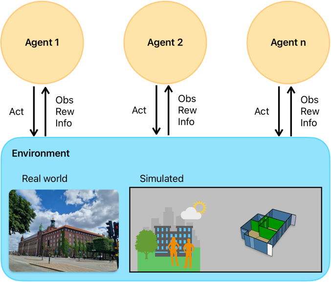

Getting Started with eprllib
=============================

Welcome to eprllib! This guide will help you get started with using eprllib for building
control and energy optimization through Reinforcement Learning (RL).

eprllib leverages RL, a powerful machine learning technique, to develop intelligent
agents that can interact with building simulations. In RL, agents learn to make decisions
by interacting with an environment, taking actions, receiving observations, and obtaining
rewards. This interaction is used to learn an optimal policy, which is a strategy that
maps observations to actions.

The general scheme of RL can be visualized in the following diagram:

Deep Reinforcement Learning (DRL)
---------------------------------

During the learning process, the RL algorithm attempts to predict the cumulative reward that the
agent will receive if it follows a certain policy. This prediction can be represented by a Value
function, denoted as ``V(obs)``, or an Action-Value function, denoted as ``Q(obs, act)``.

A modern approach to predicting these ``V`` or ``Q`` functions involves using **deep neural networks (DNNs)**
to approximate these values. When DNNs are used, the methodology is referred to as
**Deep Reinforcement Learning (DRL)**. In this context, the DNN model is often referred to as the **policy**.

In essence, the policy is a complex function that, given an observation, outputs the best action to take.

eprllib, EnergyPlus, and RLlib
-------------------------------

eprllib leverages two powerful tools: **EnergyPlus** and **RLlib**.

*   **EnergyPlus** is used to model the building environment. It simulates the building's
    energy performance and provides the environment with which the RL agent interacts.
    `EnergyPlus <https://energyplus.net/>`_
*   **RLlib** is a framework for Deep Reinforcement Learning (DRL). eprllib uses RLlib to train,
    evaluate, save, and restore policies. `RLlib <https://docs.ray.io/en/latest/rllib/index.html>`_

In essence, EnergyPlus provides the simulated world, and RLlib provides the tools to train the
agent within that world.

Running a Simple Experiment with eprllib and RLlib
---------------------------------------------------

Now that you have a basic understanding of the concepts, let's walk through a simple experiment using 
eprllib and RLlib. This example will demonstrate the core steps involved in setting up and training an agent.

**Steps:**

1.  **Define the Environment:** Use EnergyPlus to create or load a building model that will serve as the environment for the RL agent.
2.  **Define the Agent:** Specify the agent's actions, observations, and reward structure. This is done using eprllib's configuration tools.
3.  **Configure the RL Algorithm:** Choose an appropriate RL algorithm from RLlib and configure its hyperparameters.
4.  **Train the Agent:** Run the training process, allowing the agent to interact with the EnergyPlus environment and learn an optimal policy.
5.  **Evaluate the Agent:** Assess the performance of the trained agent in the EnergyPlus environment.
6.  **Save and Restore the Agent:** Save the trained agent to use it in the future.

**Example:**

The following code provides a basic outline of how to set up and train an agent using eprllib. This example 
uses a simplified environment and agent configuration for clarity.

We start defining an `eprllib.Environment.EnvironmentConfig` object:

.. code-block:: python
    :linenos:

    from eprllib.Environment.EnvironmentConfig import EnvironmentConfig

    eprllib_config = EnvironmentConfig()

After that, we need to configurate it. A first step could be configurate the general aspects
of the environment.

.. code-block:: python
    :linenos:

    eprllib_config.generals(
        epjson_path="path/to/your/model.epJSON",  # Replace with your EPJSON file.
        epw_path="path/to/your/weather.epw",  # Replace with your EPW file.
        output_path="path/to/your/output/folder", # Replace with your folder path.
        ep_terminal_output=False,
        timeout=10,
        evaluation=False,
    )

Once we have defined the paths necessary to work with `eprllib` and all the dependencies
like EnergyPlus, we can define the agents configurations.

.. code-block:: python
    :linenos:

    # ActionMapper.
    from eprllib.Agents.ActionMappers.SetpointActionMappers import DualSetpointDiscreteAndAvailabilityActionMapper
    # Filters.
    from eprllib.Agents.Filters.DefaultFilter import DefaultFilter
    # Rewards.
    from eprllib.Agents.Rewards.EnergyAndAshrae55SimpleModel import EnergyAndASHRAE55SimpleModel
    # Specs to facilitate the building of agents.
    from eprllib.Agents.AgentSpec import AgentSpec, ObservationSpec, ActionSpec
    from eprllib.Agents.Rewards.RewardSpec import RewardSpec
    from eprllib.Agents.ActionMappers.ActionMapperSpec import ActionMapperSpec
    from eprllib.Agents.Filters.FilterSpec import FilterSpec

    eprllib_config.agents(
        agents_config={
            # Here we will configurate only one agent, but you can include more.
            "agent_1": AgentSpec(
                # Observation variables definition.
                observation=ObservationSpec(
                    variables=[
                        ("Site Outdoor Air Drybulb Temperature", "Environment"),
                        ("Zone Mean Air Temperature", "Thermal Zone"),
                    ],
                    meters=[
                        "Electricity:Building",
                    ],
                ),
                # Actuators that the agent can control.
                action=ActionSpec(
                    actuators=[
                        ("Schedule:Compact", "Schedule Value", "heating_setpoint"),
                        ("Schedule:Compact", "Schedule Value", "cooling_setpoint"),
                        ("Schedule:Constant", "Schedule Value", "HVAC_OnOff"),
                    ],
                ),
                # Filter configuration.
                filter=FilterSpec(
                    filter_fn=DefaultFilter,
                    filter_fn_config={},
                ),
                # Trigger configuration.
                action_mapper=ActionMapperSpec(
                    action_mapper=DualSetpointDiscreteAndAvailabilityActionMapper,
                    action_mapper_config={
                        'temperature_range': (18, 28),
                        'actuator_for_cooling': ("Schedule:Compact", "Schedule Value", "cooling_setpoint"),
                        'actuator_for_heating': ("Schedule:Compact", "Schedule Value", "heating_setpoint"),
                        'availability_actuator': ("Schedule:Constant", "Schedule Value", "HVAC_OnOff"),
                    },
                ),
                # Reward configuration.
                reward=RewardSpec(
                    reward_fn=EnergyAndASHRAE55SimpleModel,
                    reward_fn_config={
                        "thermal_zone": "Thermal Zone",
                        "beta": 0.001,
                        'people_name': "People",
                        'cooling_name': "Cooling:DistrictCooling",
                        'heating_name': "Heating:DistrictHeatingWater",
                        'cooling_energy_ref': None,
                        'heating_energy_ref': None,
                    },
                ),
            ),
        }
    )

Now we have an agent configured. We need to define the `AgentsConnectors` class that we will use. In this 
case that we have only one agent, a `DefaultConnector` is enough.

.. code-block:: python
    :linenos:

    from eprllib.Connectors.DefaultConnector import DefaultConnector

    eprllib_config.connect(
        connector_fn=DefaultConnector,
        connector_fn_config={},
    )

The model can be take as is configured from EnergyPlus or you can apply an `Episodes` class to 
change the behavior of the environment between episodes.

.. code-block:: python
    :linenos:

    from eprllib.Episodes.DefaultEpisode import DefaultEpisode

    eprllib_config.episodes(
        episode_fn = DefaultEpisode,
        episode_fn_config = {}
    )

Now we build the configuration of the environment.

.. code-block:: python
    :linenos:

    env_config = eprllib_config.build()

Finally, you can register the environment and introduce it in the configuration of RLlib. To register 
the environment we use the `ray.tune.register_env` function. Consider that before register the 
environment the ray serve must to be inicialized.

.. code-block:: python
    :linenos:

    from eprllib.Environment.Environment import Environment
    import ray
    from ray.tune import register_env

    ray.init()

    register_env("eprllib_env", env_creator=lambda args: Environment(args))

In the configuration of `rllib` you need to configurate the environment and all the others parameters 
that your algorithm need. Here we show how to configurate the environment in a PPO algorithm.

.. code-block:: python
    :linenos:

    from ray.rllib.algorithms.ppo.ppo import PPOConfig

    config = ppo.PPOConfig()
    # Configure the PPO algorithm
    config = config.environment(
        env="eprllib_env", # Use the registered environment name
        env_config=env_config # Here is the builded configuration of the environment with eprllib.
        )  
    
    # eprllib is a multiagent environment, for that reason you need to configurate the multi_agent policy.
    config = config.multi_agent(
        policies={
            'single_policy': None
        },
        policy_mapping_fn=lambda agent_id, episode, worker, **kwargs: 'single_policy',
    )
    # Build the algorithm.
    algorithm = config.build()

With the algorithm builded, you can now train it:

.. code-block:: python
    :linenos:

    from ray.tune.logger import pretty_print

    # Train the agent for a few iterations
    for i in range(5):
        result = algorithm.train()
        print(f"Training iteration {i + 1}:")
        print(pretty_print(result))

    # Save the trained agent
    checkpoint_path = algorithm.save()
    print(f"Checkpoint saved to {checkpoint_path}")

    # Restore the agent from the checkpoint
    algorithm.restore(checkpoint_path)
    print(f"Checkpoint restored from {checkpoint_path}")

    # --- End ---
    ray.shutdown()

**Explanation:**

1.  **Environment Configuration:**
    *   We start by creating an `EnvironmentConfig` object. This object holds all the information about the EnergyPlus environment, such as the EPJSON file, the EPW file, and the output path.
    *   We use the `eprllib_config.generals()` method to set these general parameters.
    *   You'll need to replace the placeholder paths with your actual file paths.

2.  **Agent Configuration:**
    *   We define the agent's behavior using `eprllib_config.agents()`.
    *   We specify the agent's **observations** (what it can see), **actions** (what it can do), **rewards** (what it's trying to maximize), **filters** and **triggers**.
    *   In this simplified example, the agent observes the outdoor air temperature and the zone mean air temperature.
    *   The agent can control the heating and cooling setpoints and the HVAC on/off.
    *   The reward function is a placeholder in this example.
    * The filter and trigger are defined.

3.  **Episode Configuration:**
    *   We define the episode configuration using `eprllib_config.episodes()`.
    *   In this example, the episode function is a placeholder.

4.  **RLlib Configuration:**
    *   We initialize Ray, which is the framework that RLlib uses for distributed computing.
    *   We register our environment with Ray using `register_env`.
    *   We build the environment configuration using `eprllib_config.build()`.
    *   We configure the PPO algorithm using `ppo.PPOConfig()`.
    *   We specify the environment, the framework (PyTorch), and the number of rollout workers (0 for simplicity).
    *   We define a simple neural network model with two hidden layers of 64 units each.
    *   We define a single policy.
    *   We build the algorithm using `config.build()`.

5.  **Training:**
    *   We train the agent for a few iterations using a `for` loop and `algorithm.train()`.
    *   The `pretty_print()` function is used to display the training results.

6.  **Save and Restore:**
    *   We save the trained agent to a checkpoint using `algorithm.save()`.
    *   We restore the agent from the checkpoint using `algorithm.restore()`.

7.  **End:**
    *   We shutdown the ray.

This example provides a basic framework for training an agent with eprllib and RLlib. You can expand upon this example by adding more complex environment configurations, agent behaviors, and reward functions.

**Next Steps:**

1.  **Replace Placeholders:** Replace the placeholder file paths and reward function with your actual values.
2.  **Run the Code:** Run the code to see the agent training.
3.  **Experiment:** Modify the code to explore different environment configurations, agent behaviors, and hyperparameters.

This simplified example should give you a good starting point for using eprllib and RLlib.
