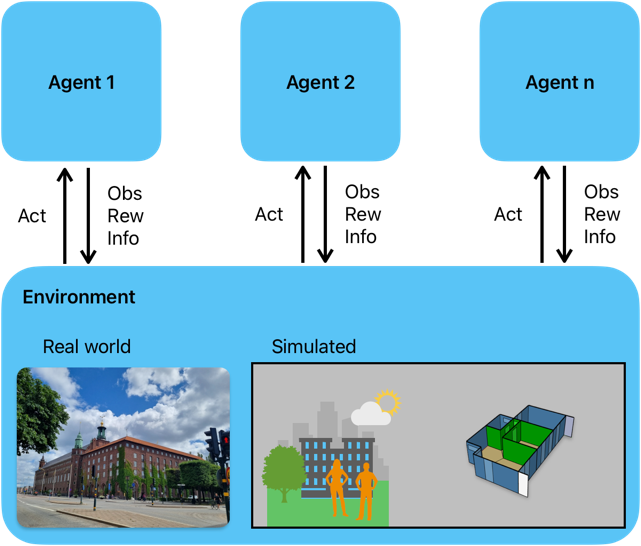

Environment API
===============

Introduction
------------

In eprllib, the **Environment** represents the interface between the Reinforcement Learning (RL) agents and the EnergyPlus building simulation. It's responsible for managing the simulation, providing observations to the agents, receiving actions from the agents, and calculating rewards. This document provides a detailed explanation of the Environment API in eprllib, focusing on the `EnvironmentConfig` and `Environment` classes.

EnvironmentConfig: Configuring the Environment
----------------------------------------------

The ``EnvironmentConfig`` class is the central configuration object for defining the environment. It allows you to specify all the parameters needed to set up the EnergyPlus simulation and define the agents and episodes that will interact with it.

*   **General Parameters:**

    The ``generals()`` method of ``EnvironmentConfig`` is used to set general parameters for the environment:

    *   ``epjson_path``: Path to the EnergyPlus model file (EPJSON). This is a required parameter.
    *   ``epw_path``: Path to the weather file (EPW). This is a required parameter.
    *   ``output_path``: Path to the output directory where simulation results will be stored. If not provided, a temporary directory will be used.
    *   ``ep_terminal_output``: Boolean indicating whether to display EnergyPlus terminal output. Defaults to `False`.
    *   ``timeout``: Timeout (in seconds) for the EnergyPlus simulation. Defaults to 10 seconds.
    *   ``evaluation``: Boolean indicating whether the simulation is for evaluation. Defaults to `False`.

    .. code-block:: python

        from eprllib.Environment.EnvironmentConfig import EnvironmentConfig

        env_config = EnvironmentConfig()
        env_config.generals(
            epjson_path="path/to/your/model.epJSON",
            epw_path="path/to/your/weather.epw",
            output_path="path/to/output",
            ep_terminal_output=False,
            timeout=10,
            evaluation=False,
        )

*   **Agent Specifications:**

    The ``agents()`` method of ``EnvironmentConfig`` is used to define the agents that will interact with the environment. It allows you to specify:

    *   ``connector_fn``: The connector function to use for the agents. This function defines how agents interact with the environment. The `DefaultConnector` is provided as a standard option.
    *   ``connector_fn_config``: The configuration for the connector function. This is a dictionary of parameters that will be passed to the connector function.
    *   ``agents_config``: A dictionary containing the specifications for each agent. The keys are the agent names, and the values are `AgentSpec` objects (see the "Agents" section in the `Key Concepts <3-KeyConcepts.html>`_ documentation).

    .. code-block:: python

        from eprllib.Environment.EnvironmentConfig import EnvironmentConfig
        from eprllib.Connectors.DefaultConnector import DefaultConnector
        from eprllib.Agents.AgentSpec import AgentSpec, ObservationSpec, ActionSpec, RewardSpec, FilterSpec, TriggerSpec
        from eprllib.Agents.Filters.DefaultFilter import DefaultFilter
        from eprllib.Agents.ActionMappers.SetpointActionMappers import DualSetpointDiscreteAndAvailabilityActionMapper

        env_config = EnvironmentConfig()
        env_config.agents(
            connector_fn=DefaultConnector,
            connector_fn_config={},
            agents_config={
                "HVAC": AgentSpec(
                    observation=ObservationSpec(
                        variables=[
                            ("Site Outdoor Air Drybulb Temperature", "Environment"),
                            ("Zone Mean Air Temperature", "Thermal Zone"),
                        ],
                        meters=[
                            "Electricity:Building",
                        ],
                    ),
                    action=ActionSpec(
                        actuators=[
                            ("Schedule:Compact", "Schedule Value", "heating_setpoint"),
                            ("Schedule:Compact", "Schedule Value", "cooling_setpoint"),
                            ("Schedule:Constant", "Schedule Value", "HVAC_OnOff"),
                        ],
                    ),
                    filter=FilterSpec(
                        filter_fn=DefaultFilter,
                        filter_fn_config={},
                    ),
                    action_mapper=ActionMapperSpec(
                        action_mapper=DualSetpointDiscreteAndAvailabilityActionMapper,
                        action_mapper_config={
                            'temperature_range': (18, 28),
                            'actuator_for_cooling': ("Schedule:Compact", "Schedule Value", "cooling_setpoint"),
                            'actuator_for_heating': ("Schedule:Compact", "Schedule Value", "heating_setpoint"),
                            'availability_actuator': ("Schedule:Constant", "Schedule Value", "HVAC_OnOff"),
                        },
                    ),
                    reward=RewardSpec(
                        reward_fn=lambda agent_name, thermal_zone, beta, people_name, cooling_name, heating_name, cooling_energy_ref, heating_energy_ref, **kwargs: 0,
                        reward_fn_config={
                            "thermal_zone": "Thermal Zone",
                            "beta": 0.001,
                            'people_name': "People",
                            'cooling_name': "Cooling:DistrictCooling",
                            'heating_name': "Heating:DistrictHeatingWater",
                            'cooling_energy_ref': None,
                            'heating_energy_ref': None,
                        },
                    ),
                ),
            }
        )

*   **Episode Specifications:**

    The ``episodes()`` method of ``EnvironmentConfig`` is used to define the episodes that will interact with the environment. It allows you to specify:

    *   ``episode_fn``: The episode function to use. This function defines how an episode is executed.
    *   ``episode_fn_config``: The configuration for the episode function. This is a dictionary of parameters that will be passed to the episode function.

    .. code-block:: python

        from eprllib.Environment.EnvironmentConfig import EnvironmentConfig

        env_config = EnvironmentConfig()
        env_config.episodes(
            episode_fn=lambda **kwargs: None,
            episode_fn_config={}
        )

*   **RLlib Configuration:**

    The ``EnvironmentConfig`` object is used to provide the environment configuration to RLlib. This configuration is passed to the `Environment` class when it is created.

*   **Building the Configuration:**

    The ``build()`` method of ``EnvironmentConfig`` is used to build the configuration. This method validates the configuration and returns a dictionary that can be used to create an `Environment` object.

    .. code-block:: python

        from eprllib.Environment.EnvironmentConfig import EnvironmentConfig

        env_config = EnvironmentConfig()
        # ... Configure the environment ...
        env_config_builded = env_config.build()

    .. image:: Images/env_config.png
        :width: 600
        :alt: EnvironmentConfig diagram
        :align: center

Environment: The Environment Class
----------------------------------

The ``Environment`` class (located in `eprllib.Environment.Environment`) is the core of the Environment API in eprllib. It serves as the base class for creating custom environments that interact with EnergyPlus.

*   **Role and Responsibilities:**

    ``Environment`` is responsible for:

    *   Initializing and managing the EnergyPlus simulation.
    *   Providing observations to the agents.
    *   Receiving actions from the agents.
    *   Calculating rewards.
    *   Interacting with RLlib.
    *   Managing the simulation flow.

*   **Interaction with EnergyPlus:**

    ``Environment`` interacts with EnergyPlus through its Python API. It uses callback points to read sensor data, set actuator values, and control the simulation flow.

*   **Interaction with RLlib:**

    ``Environment`` implements the necessary methods for RLlib to interact with the environment, such as ``step()`` and ``reset()``.

*   **Key Methods:**

    *   ``step(action)``: This method takes an action from the agent, applies it to the environment, advances the simulation, and returns the next observation, reward, done flag, and info dictionary.
    *   ``reset()``: This method resets the environment to its initial state and returns the initial observation.

EnergyPlus Integration
----------------------

eprllib leverages the EnergyPlus Python API to interact with the building simulation.

*   **The EnergyPlus Python API:**

    The EnergyPlus Python API allows you to:

    *   Read sensor data from the simulation.
    *   Set actuator values in the simulation.
    *   Control the simulation flow (e.g., advance time steps).

*   **Callback Points:**

    Callback points are specific points in the EnergyPlus simulation where eprllib can interact with the simulation. eprllib uses callback points to:

    *   Read sensor data at the beginning of each time step.
    *   Set actuator values at the beginning of each time step.
    *   Control the simulation flow at the end of each time step.

*   **Reading Sensor Data:**

    eprllib reads sensor data from EnergyPlus using the ``eplus_api.exchange.get_variable_handle()`` and ``eplus_api.exchange.get_variable_value()`` functions.

*   **Setting Actuator Values:**

    eprllib sets actuator values in EnergyPlus using the ``eplus_api.exchange.get_actuator_handle()`` and ``eplus_api.exchange.set_actuator_value()`` functions.

*   **Controlling Simulation Flow:**

    eprllib controls the simulation flow by advancing the simulation time step by step.

How work the standard environment in DRL
-----------------------------------------

RLlib Integration
-----------------

eprllib environments are designed to be used seamlessly with RLlib.

*   **Using ``Environment`` with RLlib:**

    To use an ``Environment`` with RLlib, you need to:

    1.  Register the environment with RLlib using ``register_env()``.
    2.  Use the registered environment name in your RLlib configuration.

    .. code-block:: python

        import ray
        from ray.tune import register_env
        from eprllib.Environment.Environment import Environment

        # Register the environment
        register_env(name="EPEnv", env_creator=lambda args: Environment(args))

        # Use the environment in your RLlib configuration
        config = ppo.PPOConfig()
        config = config.environment(env="EPEnv", env_config=env_config)

*   **Observation and Action Spaces:**

    ``Environment`` defines the observation and action spaces for the agents.

    *   **Observation Space:** The observation space is defined by the ``ObservationSpec`` of the agents.
    *   **Action Space:** The action space is defined by the ``ActionSpec`` of the agents.

Episodes
--------

Episodes define the configuration of the simulation.

*   **Defining the Episodes:**

    The ``episodes()`` method of ``EnvironmentConfig`` is used to define the episodes that will interact with the environment. It allows you to specify:

    *   ``episode_fn``: The episode function to use.
    *   ``episode_fn_config``: The configuration for the episode function.

    .. code-block:: python

        from eprllib.Environment.EnvironmentConfig import EnvironmentConfig

        env_config = EnvironmentConfig()
        env_config.episodes(
            episode_fn=lambda **kwargs: None,
            episode_fn_config={}
        )

Custom Environments
-------------------

While eprllib provides a robust ``Environment``, you might need to create custom environments for specific use cases.

*   **Inheriting from ``Environment``:**

    To create a custom environment, you can inherit from ``Environment`` and override its methods.

*   **Overriding Methods:**

    You can override methods like ``step()``, ``reset()``, or any other method to customize the behavior of your environment.

By understanding these concepts, you'll be able to effectively use and customize the Environment API in eprllib for your building energy optimization and control projects.

