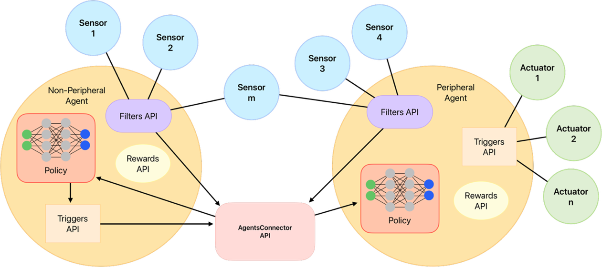

Agents API
==========

Introduction
------------

In eprllib, **Agents** are the decision-making entities that interact with the EnergyPlus environment. They observe the environment, take actions, and receive rewards based on their performance. The Agents API provides a structured way to define the behavior and capabilities of these agents. This document provides a detailed explanation of the Agents API in eprllib.

AgentSpec: Defining an Agent
----------------------------

The ``AgentSpec`` class is the central class for defining an agent. It encapsulates all the information about an agent's capabilities and behavior. An ``AgentSpec`` object is composed of:

*   **ObservationSpec:** Defines what the agent can observe in the environment.
*   **ActionSpec:** Defines what actions the agent can take.
*   **RewardSpec:** Defines how the agent is rewarded for its actions.
*   **FilterSpec:** Defines how the agent's observations are filtered.
*   **TriggerSpec:** Defines when the agent's actions are triggered.

To create an agent, you need to import the ``AgentSpec`` class:

.. code-block:: python

    from eprllib.Agents.AgentSpec import AgentSpec

ObservationSpec: What the Agent Sees
------------------------------------

The ``ObservationSpec`` class defines the agent's observation space. It specifies what the agent can "see" in the environment. It allows you to define:

*   ``variables``: A list of EnergyPlus variables that the agent can observe. Each variable is defined by a tuple of (variable name, variable type).
*   ``meters``: A list of EnergyPlus meters that the agent can observe.
*   ``simulation_parameters``: A dictionary of EnergyPlus simulation parameters that the agent can observe.
*   ``internal_variables``: A list of internal variables that the agent can observe.
*   ``use_actuator_state``: A boolean indicating whether the agent can observe the state of the actuators.
*   ``use_one_day_weather_prediction``: A boolean indicating whether the agent can observe the weather prediction.
*   ``prediction_hours``: The number of hours of weather prediction that the agent can observe.
*   ``prediction_variables``: A dictionary of weather prediction variables that the agent can observe.

.. code-block:: python

    from eprllib.Agents.AgentSpec import ObservationSpec

    observation_spec = ObservationSpec(
        variables=[
            ("Site Outdoor Air Drybulb Temperature", "Environment"),
            ("Zone Mean Air Temperature", "Thermal Zone"),
        ],
        meters=[
            "Electricity:Building",
        ],
        simulation_parameters = {
            'today_weather_horizontal_ir_at_time': True,
        },
        use_actuator_state = True,
        use_one_day_weather_prediction = True,
        prediction_hours = 3,
        prediction_variables = {
            'outdoor_dry_bulb': True,
        },
        internal_variables = [
            ("Zone Floor Area", "Thermal Zone"),
        ],
    )

ActionSpec: What the Agent Does
-------------------------------

The ``ActionSpec`` class defines the agent's action space. It specifies what actions the agent can take in the environment. It allows you to define:

*   ``actuators``: A list of EnergyPlus actuators that the agent can control. Each actuator is defined by a tuple of (actuator type, actuator name, actuator control type).
*   ``action_fn``: A function that defines how the agent's actions are translated into actuator values.
*   ``action_fn_config``: A dictionary of parameters that will be passed to the action function.

.. code-block:: python

    from eprllib.Agents.AgentSpec import ActionSpec

    action_spec = ActionSpec(
        actuators=[
            ("Schedule:Compact", "Schedule Value", "heating_setpoint"),
            ("Schedule:Compact", "Schedule Value", "cooling_setpoint"),
            ("Schedule:Constant", "Schedule Value", "HVAC_OnOff"),
        ],
        # action_fn = SetpointAgentActions,
        # action_fn_config = {
        #     'agent_name': 'HVAC_agent',
        #     'availability_actuator': ("Schedule:Constant", "Schedule Value", "HVAC_availability")
        # }
    )

RewardSpec: What Motivates the Agent
------------------------------------

The ``RewardSpec`` class defines how the agent is rewarded for its actions. It specifies the reward function and its configuration. It allows you to define:

*   ``reward_fn``: A function that calculates the reward based on the agent's actions and the environment's state.
*   ``reward_fn_config``: A dictionary of parameters that will be passed to the reward function.

.. code-block:: python

    from eprllib.Agents.AgentSpec import RewardSpec

    reward_spec = RewardSpec(
        reward_fn=lambda agent_name, thermal_zone, beta, people_name, cooling_name, heating_name, cooling_energy_ref, heating_energy_ref, **kwargs: 0,
        reward_fn_config={
            "agent_name": "HVAC",
            "thermal_zone": "Thermal Zone",
            "beta": 0.001,
            'people_name': "People",
            'cooling_name': "Cooling:DistrictCooling",
            'heating_name': "Heating:DistrictHeatingWater",
            'cooling_energy_ref': None,
            'heating_energy_ref': None,
        },
    )

FilterSpec: Filtering Observations
----------------------------------

The ``FilterSpec`` class defines how the agent's observations are filtered. It specifies the filter function and its configuration. It allows you to define:

*   ``filter_fn``: A function that filters the observations.
*   ``filter_fn_config``: A dictionary of parameters that will be passed to the filter function.

The ``DefaultFilter`` is provided as a standard option.

.. code-block:: python

    from eprllib.Agents.AgentSpec import FilterSpec
    from eprllib.Agents.Filters.DefaultFilter import DefaultFilter

    filter_spec = FilterSpec(
        filter_fn=DefaultFilter,
        filter_fn_config={},
    )

TriggerSpec: Triggering Actions
-------------------------------

The ``TriggerSpec`` class defines when the agent's actions are triggered. It specifies the trigger function and its configuration. It allows you to define:

*   ``trigger_fn``: A function that determines when to trigger an action.
*   ``trigger_fn_config``: A dictionary of parameters that will be passed to the trigger function.

The ``DualSetpointTriggerDiscreteAndAvailabilityTrigger`` is provided as a standard option.

.. code-block:: python

    from eprllib.Agents.AgentSpec import TriggerSpec
    from eprllib.Agents.Triggers.SetpointTriggers import DualSetpointTriggerDiscreteAndAvailabilityTrigger

    trigger_spec = TriggerSpec(
        trigger_fn=DualSetpointTriggerDiscreteAndAvailabilityTrigger,
        trigger_fn_config={
            "agent_name": "HVAC",
            'temperature_range': (18, 28),
            'actuator_for_cooling': ("Schedule:Compact", "Schedule Value", "cooling_setpoint"),
            'actuator_for_heating': ("Schedule:Compact", "Schedule Value", "heating_setpoint"),
            'availability_actuator': ("Schedule:Constant", "Schedule Value", "HVAC_OnOff"),
        },
    )

Integrating Agents with EnvironmentConfig
-----------------------------------------

Once you have defined your agents using ``AgentSpec``, you need to integrate them into the environment configuration using the ``EnvironmentConfig`` class. The ``agents()`` method of ``EnvironmentConfig`` allows you to specify the agents that will interact with the environment.

The ``agents()`` method takes the following parameters:

*   ``connector_fn``: The connector function to use for the agents.
*   ``connector_fn_config``: The configuration for the connector function.
*   ``agents_config``: A dictionary where the keys are the agent names and the values are the ``AgentSpec`` objects.

.. code-block:: python

    from eprllib.Environment.EnvironmentConfig import EnvironmentConfig
    from eprllib.AgentsConnectors.DefaultConnector import DefaultConnector
    from eprllib.Agents.AgentSpec import AgentSpec, ObservationSpec, ActionSpec, RewardSpec, FilterSpec, TriggerSpec
    from eprllib.Agents.Filters.DefaultFilter import DefaultFilter
    from eprllib.Agents.Triggers.SetpointTriggers import DualSetpointTriggerDiscreteAndAvailabilityTrigger

    # Define the agent
    agent_spec = AgentSpec(
        observation=ObservationSpec(
            variables=[
                ("Site Outdoor Air Drybulb Temperature", "Environment"),
                ("Zone Mean Air Temperature", "Thermal Zone"),
            ],
            meters=[
                "Electricity:Building",
            ],
        ),
        action=ActionSpec(
            actuators=[
                ("Schedule:Compact", "Schedule Value", "heating_setpoint"),
                ("Schedule:Compact", "Schedule Value", "cooling_setpoint"),
                ("Schedule:Constant", "Schedule Value", "HVAC_OnOff"),
            ],
        ),
        filter=FilterSpec(
            filter_fn=DefaultFilter,
            filter_fn_config={},
        ),
        trigger=TriggerSpec(
            trigger_fn=DualSetpointTriggerDiscreteAndAvailabilityTrigger,
            trigger_fn_config={
                "agent_name": "HVAC",
                'temperature_range': (18, 28),
                'actuator_for_cooling': ("Schedule:Compact", "Schedule Value", "cooling_setpoint"),
                'actuator_for_heating': ("Schedule:Compact", "Schedule Value", "heating_setpoint"),
                'availability_actuator': ("Schedule:Constant", "Schedule Value", "HVAC_OnOff"),
            },
        ),
        reward=RewardSpec(
            reward_fn=lambda agent_name, thermal_zone, beta, people_name, cooling_name, heating_name, cooling_energy_ref, heating_energy_ref, **kwargs: 0,
            reward_fn_config={
                "agent_name": "HVAC",
                "thermal_zone": "Thermal Zone",
                "beta": 0.001,
                'people_name': "People",
                'cooling_name': "Cooling:DistrictCooling",
                'heating_name': "Heating:DistrictHeatingWater",
                'cooling_energy_ref': None,
                'heating_energy_ref': None,
            },
        ),
    )

    # Create the EnvironmentConfig object
    env_config = EnvironmentConfig()

    # Integrate the agent into the environment configuration
    env_config.agents(
        connector_fn=DefaultConnector,
        connector_fn_config={},
        agents_config={
            "HVAC": agent_spec,
        }
    )

AgentsConnector API: Agent Interaction
--------------------------------------

The ``AgentsConnector`` API defines how agents interact with the environment and with each other. It provides a flexible way to implement different interaction patterns, such as:

*   **Cooperative Agents:** Agents work together to achieve a common goal.
*   **Hierarchical Agents:** Agents are organized in a hierarchy, with some agents controlling others.
*   **Competitive Agents:** Agents compete against each other.

*   **DefaultConnector:**

    The ``DefaultConnector`` is the standard way for agents to interact with the environment. It handles:

    *   Receiving observations from the environment.
    *   Sending actions to the environment.
    *   Receiving rewards from the environment.

*   **Custom Connectors:**

    You can create custom connectors to implement different interaction patterns between agents and the environment. This allows for flexibility in how agents are integrated into the simulation.

Work in progress...

By understanding these concepts, you'll be able to effectively define and use agents in eprllib for your building energy optimization and control projects.
