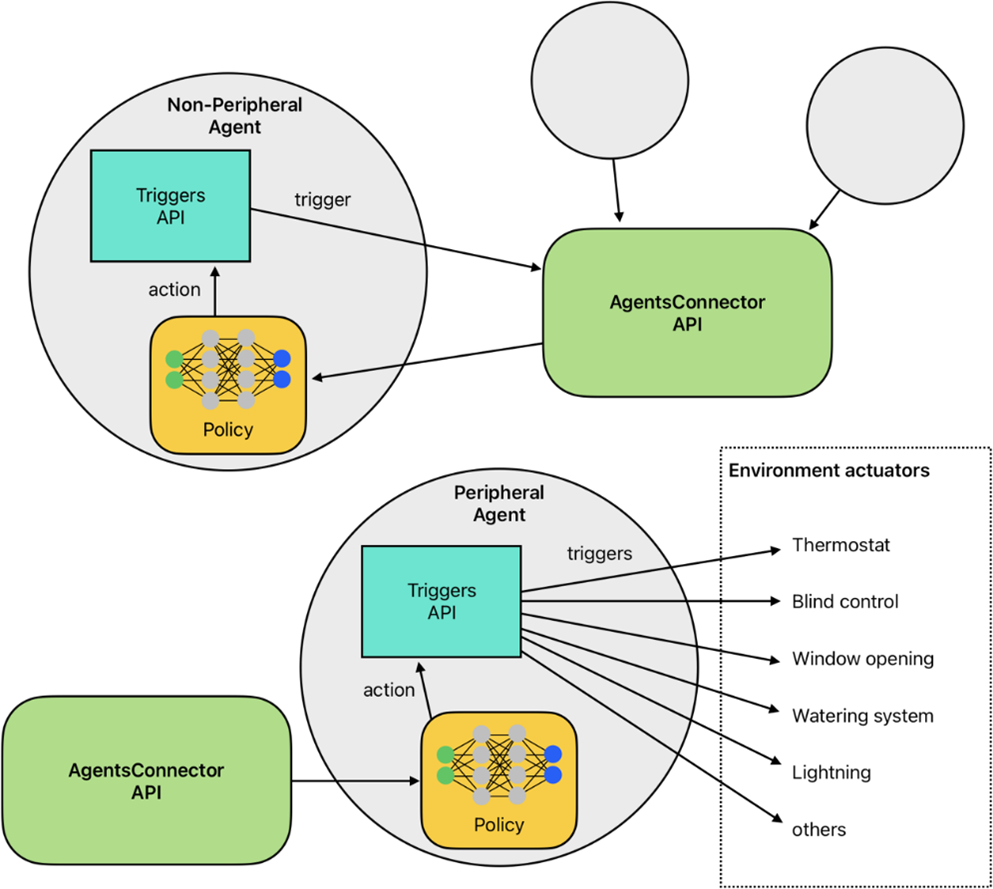

ActionMapper API
================

Introduction
------------

In eprllib, **Triggers** determine when an agent's actions are executed. They provide a mechanism to control the timing of actions, allowing for more complex and nuanced agent behavior. This document provides a detailed explanation of the Triggers API in eprllib.

TriggerSpec: Defining Action Triggers
-------------------------------------

The ``ActionMapperSpec`` class is used to define when an agent's actions are triggered. It specifies the trigger function and its configuration. It allows you to define:

*   ``action_mapper``: A function that determines when to trigger an action.
*   ``action_mapper_config``: A dictionary of parameters that will be passed to the trigger function.

.. code-block:: python

    from eprllib.Agents.AgentSpec import TriggerSpec
    from eprllib.Agents.Triggers.SetpointTriggers import DualSetpointTriggerDiscreteAndAvailabilityTrigger

    action_mapper = ActionMapperSpec(
        action_mapper=DualSetpointDiscreteAndAvailabilityActionMapper,
        action_mapper_config={
            'temperature_range': (18, 28),
            'actuator_for_cooling': ("Schedule:Compact", "Schedule Value", "cooling_setpoint"),
            'actuator_for_heating': ("Schedule:Compact", "Schedule Value", "heating_setpoint"),
            'availability_actuator': ("Schedule:Constant", "Schedule Value", "HVAC_OnOff"),
        },
    )

ActionMapper Functions (action_mapper)
--------------------------------------

ActionMapper functions are responsible for determining when an agent's actions should be executed. They take into account the current state of the environment and the agent's observations to make this decision.

*   **DualSetpointDiscreteAndAvailabilityActionMapper:**

    The ``DualSetpointDiscreteAndAvailabilityActionMapper`` is a built-in trigger function that is commonly used for HVAC control. It triggers actions based on:

    *   **Temperature Range:** The desired temperature range for the zone.
    *   **Cooling Actuator:** The actuator used to control cooling.
    *   **Heating Actuator:** The actuator used to control heating.
    *   **Availability Actuator:** The actuator used to control the availability of the HVAC system.

*   **Creating Custom ActionMapper Functions:**

    You can create custom trigger functions to implement more complex triggering logic. A trigger function should:

    *   Take the current state of the environment and the agent's observations as input.
    *   Return a boolean value indicating whether the action should be triggered.

Trigger Function Configuration (trigger_fn_config)
--------------------------------------------------

Trigger functions can be configured using the ``trigger_fn_config`` parameter in ``TriggerSpec``. This allows you to customize the behavior of the trigger function without modifying its code.

*   **Configuring DualSetpointDiscreteAndAvailabilityActionMapper:**

    The ``DualSetpointDiscreteAndAvailabilityActionMapper`` can be configured with the following parameters:

    *   ``temperature_range``: A tuple defining the desired temperature range (min, max).
    *   ``actuator_for_cooling``: The actuator used to control cooling.
    *   ``actuator_for_heating``: The actuator used to control heating.
    *   ``availability_actuator``: The actuator used to control the availability of the HVAC system.

*   **Defining Custom Configuration Parameters:**

    When creating custom trigger functions, you can define your own configuration parameters to control their behavior.

Integrating ActionMapper with AgentSpec
---------------------------------------

Once you have defined your trigger using ``ActionMapperSpec``, you need to integrate it into the agent definition using the ``AgentSpec`` class. The ``trigger`` parameter of ``AgentSpec`` is used to specify the trigger for the agent.

.. code-block:: python

    from eprllib.Agents.AgentSpec import AgentSpec, ActionMapperSpec
    from eprllib.Agents.Triggers.SetpointTriggers import DualSetpointTriggerDiscreteAndAvailabilityTrigger

    # Define the action mapper
    action_mapper_spec = ActionMapperSpec(
        action_mapper=DualSetpointDiscreteAndAvailabilityActionMapper,
        action_mapper_config={
            'temperature_range': (18, 28),
            'actuator_for_cooling': ("Schedule:Compact", "Schedule Value", "cooling_setpoint"),
            'actuator_for_heating': ("Schedule:Compact", "Schedule Value", "heating_setpoint"),
            'availability_actuator': ("Schedule:Constant", "Schedule Value", "HVAC_OnOff"),
        },
    )

    # Define the agent and integrate the trigger
    agent_spec = AgentSpec(
        # ... other agent parameters ...
        action_mapper=action_mapper_spec,
    )

Examples
--------

Here's a complete example of how to define and use triggers:

.. code-block:: python

    from eprllib.Agents.AgentSpec import AgentSpec, ObservationSpec, ActionSpec, RewardSpec, FilterSpec, TriggerSpec
    from eprllib.Agents.Filters.DefaultFilter import DefaultFilter
    from eprllib.Agents.Triggers.SetpointTriggers import DualSetpointTriggerDiscreteAndAvailabilityTrigger

    # Define the trigger
    action_mapper = ActionMapperSpec(
        action_mapper=DualSetpointDiscreteAndAvailabilityActionMapper,
        action_mapper_config={
            'temperature_range': (18, 28),
            'actuator_for_cooling': ("Schedule:Compact", "Schedule Value", "cooling_setpoint"),
            'actuator_for_heating': ("Schedule:Compact", "Schedule Value", "heating_setpoint"),
            'availability_actuator': ("Schedule:Constant", "Schedule Value", "HVAC_OnOff"),
        },
    )

    # Define the agent
    agent_spec = AgentSpec(
        observation=ObservationSpec(
            variables=[
                ("Site Outdoor Air Drybulb Temperature", "Environment"),
                ("Zone Mean Air Temperature", "Thermal Zone"),
            ],
            meters=[
                "Electricity:Building",
            ],
        ),
        action=ActionSpec(
            actuators=[
                ("Schedule:Compact", "Schedule Value", "heating_setpoint"),
                ("Schedule:Compact", "Schedule Value", "cooling_setpoint"),
                ("Schedule:Constant", "Schedule Value", "HVAC_OnOff"),
            ],
        ),
        filter=FilterSpec(
            filter_fn=DefaultFilter,
            filter_fn_config={},
        ),
        action_mapper = ActionMapperSpec(
            action_mapper=DualSetpointDiscreteAndAvailabilityActionMapper,
            action_mapper_config={
                'temperature_range': (18, 28),
                'actuator_for_cooling': ("Schedule:Compact", "Schedule Value", "cooling_setpoint"),
                'actuator_for_heating': ("Schedule:Compact", "Schedule Value", "heating_setpoint"),
                'availability_actuator': ("Schedule:Constant", "Schedule Value", "HVAC_OnOff"),
            },
        )
    )

By understanding these concepts, you'll be able to effectively define and use triggers in eprllib for your building energy optimization and control projects.
