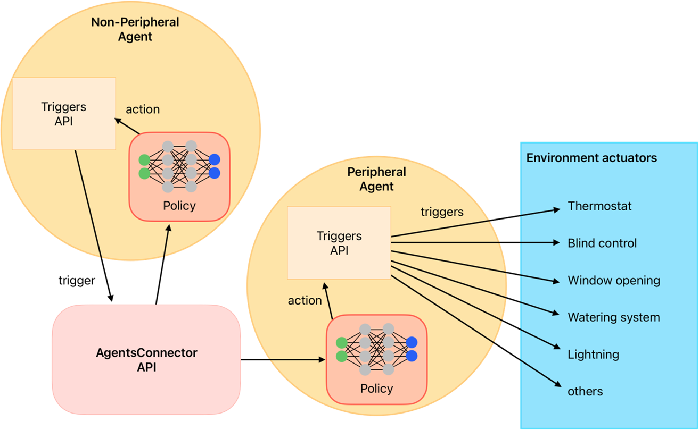

Triggers API
============

Introduction
------------

In eprllib, **Triggers** determine when an agent's actions are executed. They provide a mechanism to control the timing of actions, allowing for more complex and nuanced agent behavior. This document provides a detailed explanation of the Triggers API in eprllib.

TriggerSpec: Defining Action Triggers
-------------------------------------

The ``TriggerSpec`` class is used to define when an agent's actions are triggered. It specifies the trigger function and its configuration. It allows you to define:

*   ``trigger_fn``: A function that determines when to trigger an action.
*   ``trigger_fn_config``: A dictionary of parameters that will be passed to the trigger function.

.. code-block:: python

    from eprllib.Agents.AgentSpec import TriggerSpec
    from eprllib.Agents.Triggers.SetpointTriggers import DualSetpointTriggerDiscreteAndAvailabilityTrigger

    trigger_spec = TriggerSpec(
        trigger_fn=DualSetpointTriggerDiscreteAndAvailabilityTrigger,
        trigger_fn_config={
            "agent_name": "HVAC",
            'temperature_range': (18, 28),
            'actuator_for_cooling': ("Schedule:Compact", "Schedule Value", "cooling_setpoint"),
            'actuator_for_heating': ("Schedule:Compact", "Schedule Value", "heating_setpoint"),
            'availability_actuator': ("Schedule:Constant", "Schedule Value", "HVAC_OnOff"),
        },
    )

Trigger Functions (trigger_fn)
------------------------------

Trigger functions are responsible for determining when an agent's actions should be executed. They take into account the current state of the environment and the agent's observations to make this decision.

*   **DualSetpointTriggerDiscreteAndAvailabilityTrigger:**

    The ``DualSetpointTriggerDiscreteAndAvailabilityTrigger`` is a built-in trigger function that is commonly used for HVAC control. It triggers actions based on:

    *   **Temperature Range:** The desired temperature range for the zone.
    *   **Cooling Actuator:** The actuator used to control cooling.
    *   **Heating Actuator:** The actuator used to control heating.
    *   **Availability Actuator:** The actuator used to control the availability of the HVAC system.

*   **Creating Custom Trigger Functions:**

    You can create custom trigger functions to implement more complex triggering logic. A trigger function should:

    *   Take the current state of the environment and the agent's observations as input.
    *   Return a boolean value indicating whether the action should be triggered.

Trigger Function Configuration (trigger_fn_config)
--------------------------------------------------

Trigger functions can be configured using the ``trigger_fn_config`` parameter in ``TriggerSpec``. This allows you to customize the behavior of the trigger function without modifying its code.

*   **Configuring DualSetpointTriggerDiscreteAndAvailabilityTrigger:**

    The ``DualSetpointTriggerDiscreteAndAvailabilityTrigger`` can be configured with the following parameters:

    *   ``agent_name``: The name of the agent.
    *   ``temperature_range``: A tuple defining the desired temperature range (min, max).
    *   ``actuator_for_cooling``: The actuator used to control cooling.
    *   ``actuator_for_heating``: The actuator used to control heating.
    *   ``availability_actuator``: The actuator used to control the availability of the HVAC system.

*   **Defining Custom Configuration Parameters:**

    When creating custom trigger functions, you can define your own configuration parameters to control their behavior.

Integrating Triggers with AgentSpec
-----------------------------------

Once you have defined your trigger using ``TriggerSpec``, you need to integrate it into the agent definition using the ``AgentSpec`` class. The ``trigger`` parameter of ``AgentSpec`` is used to specify the trigger for the agent.

.. code-block:: python

    from eprllib.Agents.AgentSpec import AgentSpec, TriggerSpec
    from eprllib.Agents.Triggers.SetpointTriggers import DualSetpointTriggerDiscreteAndAvailabilityTrigger

    # Define the trigger
    trigger_spec = TriggerSpec(
        trigger_fn=DualSetpointTriggerDiscreteAndAvailabilityTrigger,
        trigger_fn_config={
            "agent_name": "HVAC",
            'temperature_range': (18, 28),
            'actuator_for_cooling': ("Schedule:Compact", "Schedule Value", "cooling_setpoint"),
            'actuator_for_heating': ("Schedule:Compact", "Schedule Value", "heating_setpoint"),
            'availability_actuator': ("Schedule:Constant", "Schedule Value", "HVAC_OnOff"),
        },
    )

    # Define the agent and integrate the trigger
    agent_spec = AgentSpec(
        # ... other agent parameters ...
        trigger=trigger_spec,
    )

Action Functions
----------------

Action functions play a crucial role in eprllib by providing flexibility in how agents' actions are translated into actuator values. They are defined within the ``ActionSpec`` class and are responsible for mapping the agent's actions to the specific actuators in the EnergyPlus environment.

*   **ActionSpec and action_fn:**

    The ``ActionSpec`` class defines the agent's action space and includes the ``action_fn`` parameter, which specifies the action function to use.

*   **action_fn_config:**

    The ``action_fn_config`` parameter in ``ActionSpec`` allows you to configure the action function with specific parameters.

*   **ActionFunction Class:**

    The ``ActionFunction`` class serves as the base class for creating custom action functions. It provides three key methods:

    *   ``get_action_space_dim()``: This method defines the action space for the agent. It should return a `gym.Space` object representing the action space.
    *   ``agent_to_actuator_action(action, actuators)``: This method maps the agent's action to a dictionary of actuator values. It takes the agent's action and a list of actuators as input and returns a dictionary where the keys are actuator names and the values are the corresponding actuator values.
    *   ``get_actuator_action(action, actuator)``: This method is responsible for mapping a single action value to a specific actuator. It takes an action value and an actuator name as input and returns the corresponding actuator value.

.. code-block:: python

    from typing import Dict, Any, List
    import gymnasium as gym
    class ActionFunction:
        def __init__(self, action_fn_config: Dict[str,Any] = {}):
            self.action_fn_config = action_fn_config

        def get_action_space_dim(self) -> gym.Space:
            return NotImplementedError("This method should be implemented in the child class.")

        def agent_to_actuator_action(self, action: Any, actuators: List[str]) -> Dict[str,Any]:
            raise NotImplementedError("This method should be implemented in the child class.")

        def get_actuator_action(self, action:float|int, actuator: str) -> Any:            
            return action

Examples
--------

Here's a complete example of how to define and use triggers:

.. code-block:: python

    from eprllib.Agents.AgentSpec import AgentSpec, ObservationSpec, ActionSpec, RewardSpec, FilterSpec, TriggerSpec
    from eprllib.Agents.Filters.DefaultFilter import DefaultFilter
    from eprllib.Agents.Triggers.SetpointTriggers import DualSetpointTriggerDiscreteAndAvailabilityTrigger

    # Define the trigger
    trigger_spec = TriggerSpec(
        trigger_fn=DualSetpointTriggerDiscreteAndAvailabilityTrigger,
        trigger_fn_config={
            "agent_name": "HVAC",
            'temperature_range': (18, 28),
            'actuator_for_cooling': ("Schedule:Compact", "Schedule Value", "cooling_setpoint"),
            'actuator_for_heating': ("Schedule:Compact", "Schedule Value", "heating_setpoint"),
            'availability_actuator': ("Schedule:Constant", "Schedule Value", "HVAC_OnOff"),
        },
    )

    # Define the agent
    agent_spec = AgentSpec(
        observation=ObservationSpec(
            variables=[
                ("Site Outdoor Air Drybulb Temperature", "Environment"),
                ("Zone Mean Air Temperature", "Thermal Zone"),
            ],
            meters=[
                "Electricity:Building",
            ],
        ),
        action=ActionSpec(
            actuators=[
                ("Schedule:Compact", "Schedule Value", "heating_setpoint"),
                ("Schedule:Compact", "Schedule Value", "cooling_setpoint"),
                ("Schedule:Constant", "Schedule Value", "HVAC_OnOff"),
            ],
        ),
        filter=FilterSpec(
            filter_fn=DefaultFilter,
            filter_fn_config={},
        ),
        trigger=trigger_spec,
        reward=RewardSpec(
            reward_fn=lambda agent_name, thermal_zone, beta, people_name, cooling_name, heating_name, cooling_energy_ref, heating_energy_ref, **kwargs: 0,
            reward_fn_config={
                "agent_name": "HVAC",
                "thermal_zone": "Thermal Zone",
                "beta": 0.001,
                'people_name': "People",
                'cooling_name': "Cooling:DistrictCooling",
                'heating_name': "Heating:DistrictHeatingWater",
                'cooling_energy_ref': None,
                'heating_energy_ref': None,
            },
        ),
    )

By understanding these concepts, you'll be able to effectively define and use triggers in eprllib for your building energy optimization and control projects.
