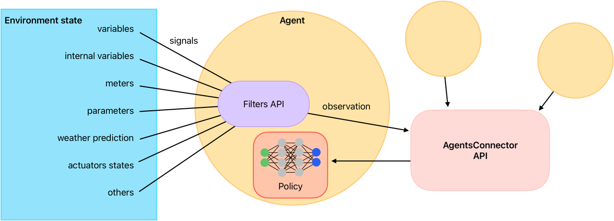

Filters API
===========

Introduction
------------

In ``eprllib``, ``Filters`` are used to process an agent's observations before they are used for 
decision-making. They provide a mechanism to modify or transform the raw observations, allowing for 
more robust and efficient agent behavior. This document provides a detailed explanation of 
the ``Filters`` API in ``eprllib``.

Relationship with ObservationSpec
---------------------------------

Filters operate on the observations defined in ``ObservationSpec``. The order of operations is as follows:

1.  **Observations are gathered:** The agent's observations are collected from the environment based on the configuration in ``ObservationSpec``.
2.  **Observations are filtered:** The raw observations are passed to the filter function defined in ``FilterSpec``.
3.  **Filtered observations are used:** The filtered observations are then used by the agent for decision-making.

Defining custom ``Filter`` functions
------------------------------------

Here's a complete example of how to define and use filters:

.. code-block:: python

    