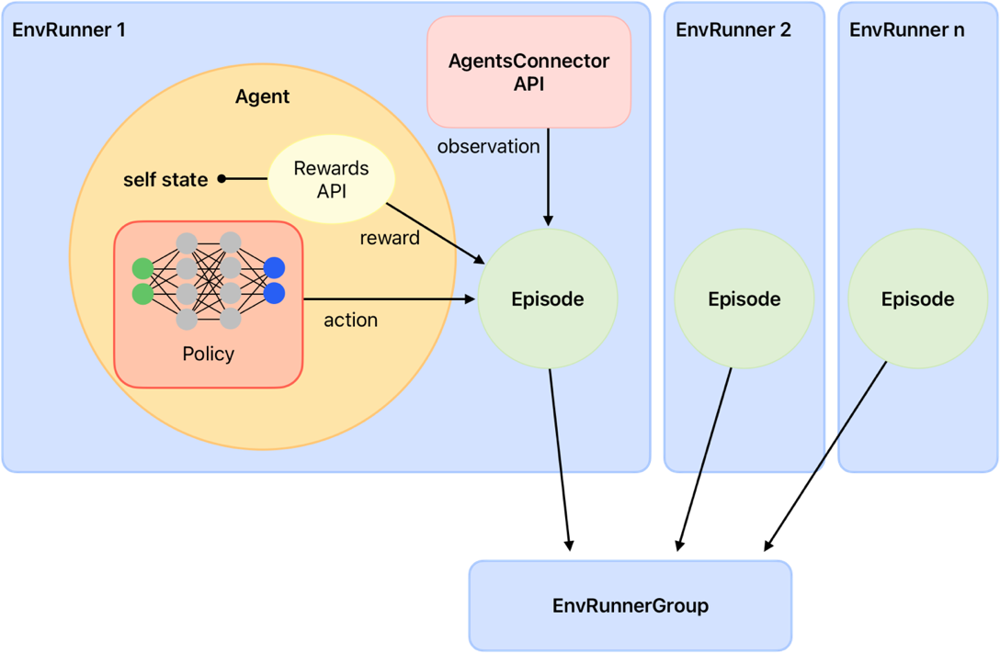

Rewards API
===========

Introduction
------------

In eprllib, **Rewards** are used to guide the learning process of Reinforcement Learning (RL) agents. They provide a numerical signal that indicates how well an agent is performing in the environment. The Rewards API provides a structured way to define and configure these reward functions. This document provides a detailed explanation of the Rewards API in eprllib.

RewardSpec: Defining Reward Functions
-------------------------------------

The ``RewardSpec`` class is used to define an agent's reward function. It specifies the reward function and its configuration. It allows you to define:

*   ``reward_fn``: A function that calculates the reward based on the agent's actions and the environment's state.
*   ``reward_fn_config``: A dictionary of parameters that will be passed to the reward function.

.. code-block:: python

    from eprllib.Agents.AgentSpec import RewardSpec

    reward_spec = RewardSpec(
        reward_fn=lambda agent_name, thermal_zone, beta, people_name, cooling_name, heating_name, cooling_energy_ref, heating_energy_ref, **kwargs: 0,
        reward_fn_config={
            "agent_name": "HVAC",
            "thermal_zone": "Thermal Zone",
            "beta": 0.001,
            'people_name': "People",
            'cooling_name': "Cooling:DistrictCooling",
            'heating_name': "Heating:DistrictHeatingWater",
            'cooling_energy_ref': None,
            'heating_energy_ref': None,
        },
    )

Reward Functions (reward_fn)
----------------------------

Reward functions are responsible for calculating the reward that the agent receives at each time step. They take into account the current state of the environment, the agent's observations, and the agent's actions to determine the reward.

*   **Common Reward Function Examples:**

    *   **Energy Consumption:** A reward function that penalizes high energy consumption.
    *   **Thermal Comfort:** A reward function that rewards the agent for maintaining comfortable temperatures.
    *   **Combined Energy and Comfort:** A reward function that balances energy consumption and thermal comfort.
    *   **Custom Metrics:** Reward functions can be created to optimize any metric available in the EnergyPlus simulation.

*   **Creating Custom Reward Functions:**

    You can create custom reward functions to implement more complex reward logic. A reward function should:

    *   Take the agent's name, the thermal zone, and any other relevant parameters as input.
    *   Take the `kwargs` to receive the `info` dictionary.
    *   Return a numerical value representing the reward.

Reward Function Configuration (reward_fn_config)
------------------------------------------------

Reward functions can be configured using the ``reward_fn_config`` parameter in ``RewardSpec``. This allows you to customize the behavior of the reward function without modifying its code.

*   **Defining Custom Configuration Parameters:**

    When creating custom reward functions, you can define your own configuration parameters to control their behavior.

* **Configuring the reward function:**

    The reward function in the example is configured with the following parameters:

    *   ``agent_name``: The name of the agent.
    *   ``thermal_zone``: The name of the thermal zone.
    *   ``beta``: A parameter used to balance different components of the reward.
    *   ``people_name``: The name of the people.
    *   ``cooling_name``: The name of the cooling.
    *   ``heating_name``: The name of the heating.
    *   ``cooling_energy_ref``: The reference of the cooling energy.
    *   ``heating_energy_ref``: The reference of the heating energy.

Integrating Rewards with AgentSpec
----------------------------------

Once you have defined your reward function using ``RewardSpec``, you need to integrate it into the agent definition using the ``AgentSpec`` class. The ``reward`` parameter of ``AgentSpec`` is used to specify the reward for the agent.

.. code-block:: python

    from eprllib.Agents.AgentSpec import AgentSpec, RewardSpec

    # Define the reward
    reward_spec = RewardSpec(
        reward_fn=lambda agent_name, thermal_zone, beta, people_name, cooling_name, heating_name, cooling_energy_ref, heating_energy_ref, **kwargs: 0,
        reward_fn_config={
            "agent_name": "HVAC",
            "thermal_zone": "Thermal Zone",
            "beta": 0.001,
            'people_name': "People",
            'cooling_name': "Cooling:DistrictCooling",
            'heating_name': "Heating:DistrictHeatingWater",
            'cooling_energy_ref': None,
            'heating_energy_ref': None,
        },
    )

    # Define the agent and integrate the reward
    agent_spec = AgentSpec(
        # ... other agent parameters ...
        reward=reward_spec,
    )

Relationship with Observations, Actions, and Environment State
--------------------------------------------------------------

Reward functions use information from the environment, the agent's observations, and the agent's actions to calculate the reward. The flow of information is as follows:

1.  **Environment State:** The reward function has access to the current state of the EnergyPlus environment.
2.  **Agent's Observations:** The reward function can use the agent's observations (as defined in ``ObservationSpec``).
3.  **Agent's Actions:** The reward function can take into account the actions that the agent has taken.
4.  **Reward Calculation:** The reward function combines this information to calculate a numerical reward value.

Using Infos in the Reward Function
----------------------------------

The `info` dictionary, returned by the `step()` method of the `Environment`, can be used to access additional information within the reward function. This allows you to create more complex and informative reward signals.

*   **Accessing the `info` Dictionary:**

    The `info` dictionary is passed to the reward function as part of the `kwargs`. You can access it like this:

    .. code-block:: python

        def my_reward_function(agent_name, thermal_zone, beta, people_name, cooling_name, heating_name, cooling_energy_ref, heating_energy_ref, **kwargs):
            info = kwargs.get("info", {})
            # ... use info to calculate the reward ...

*   **Example of Using `info`:**

    You might use `info` to access:

    *   Energy consumption data.
    *   Thermal comfort metrics.
    *   Weather data.
    *   Any other information that is available in the `info` dictionary.

Examples
--------

Here's a complete example of how to define and use a reward function:

.. code-block:: python

    from eprllib.Agents.AgentSpec import AgentSpec, ObservationSpec, ActionSpec, RewardSpec, FilterSpec, TriggerSpec
    from eprllib.Agents.Filters.DefaultFilter import DefaultFilter
    from eprllib.Agents.ActionMappers.SetpointActionMappers import DualSetpointDiscreteAndAvailabilityActionMapper

    # Define the reward
    def my_reward_function(agent_name, thermal_zone, beta, people_name, cooling_name, heating_name, cooling_energy_ref, heating_energy_ref, **kwargs):
        info = kwargs.get("info", {})
        # Example: Reward based on energy consumption and thermal comfort
        energy_consumption = info.get("Electricity:Building", 0)
        thermal_comfort = info.get("Zone Thermal Comfort ASHRAE 55 Simple Model Summer or Winter Clothes Not Comfortable Time", 0)
        reward = -energy_consumption - beta * thermal_comfort
        return reward

    reward_spec = RewardSpec(
        reward_fn=my_reward_function,
        reward_fn_config={
            "thermal_zone": "Thermal Zone",
            "beta": 0.001,
            'people_name': "People",
            'cooling_name': "Cooling:DistrictCooling",
            'heating_name': "Heating:DistrictHeatingWater",
            'cooling_energy_ref': None,
            'heating_energy_ref': None,
        },
    )

    # Define the agent
    agent_spec = AgentSpec(
        observation=ObservationSpec(
            variables=[
                ("Site Outdoor Air Drybulb Temperature", "Environment"),
                ("Zone Mean Air Temperature", "Thermal Zone"),
            ],
            meters=[
                "Electricity:Building",
            ],
        ),
        action=ActionSpec(
            actuators=[
                ("Schedule:Compact", "Schedule Value", "heating_setpoint"),
                ("Schedule:Compact", "Schedule Value", "cooling_setpoint"),
                ("Schedule:Constant", "Schedule Value", "HVAC_OnOff"),
            ],
        ),
        filter=FilterSpec(
            filter_fn=DefaultFilter,
            filter_fn_config={},
        ),
        action_mapper=ActionMapperSpec(
            action_mapper=DualSetpointDiscreteAndAvailabilityActionMapper,
            action_mapper_config={
                'temperature_range': (18, 28),
                'actuator_for_cooling': ("Schedule:Compact", "Schedule Value", "cooling_setpoint"),
                'actuator_for_heating': ("Schedule:Compact", "Schedule Value", "heating_setpoint"),
                'availability_actuator': ("Schedule:Constant", "Schedule Value", "HVAC_OnOff"),
            },
        ),
        reward=reward_spec,
    )

By understanding these concepts, you'll be able to effectively define and use reward functions in eprllib for your building energy optimization and control projects.
